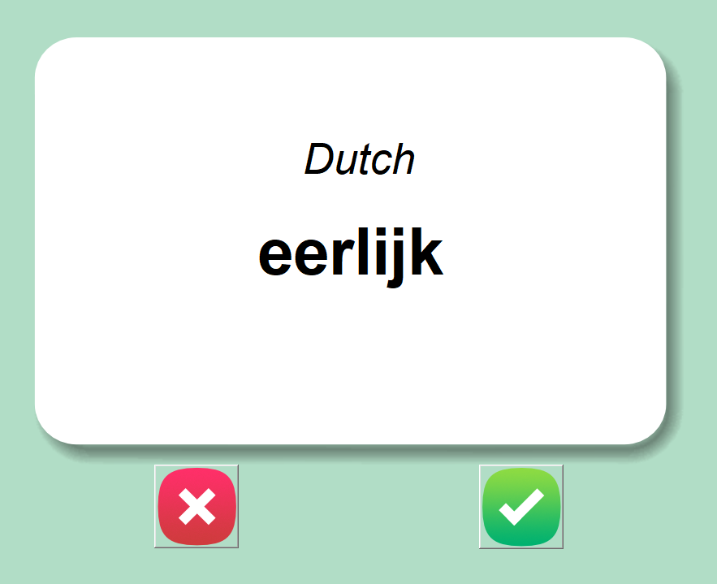
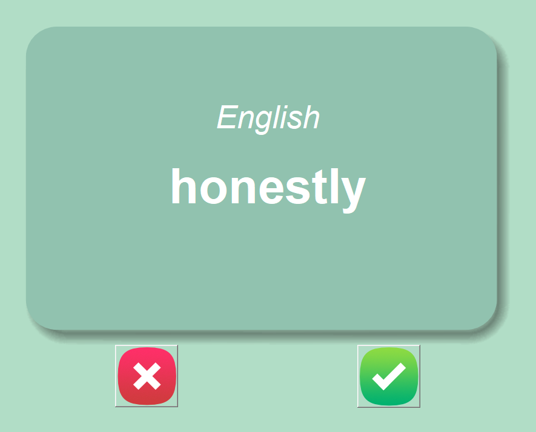

# Dutch Flash Cards
## Description
Simple Flash Card application for learning Dutch! Progress is saved to a database so you can pick up where you left off!
## How to use
1. Clone the repository
2. Run `main.py`
3. Learn Dutch!
4. To add new words, edit the `dutch_words.csv` file
5. To reset your progress, delete the `words_to_learn.csv` file

## Screenshots

Created as a part of Udemys 100 days of code course by Angela Yu.